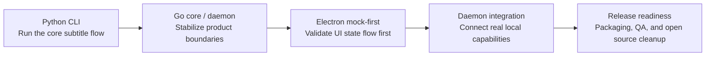
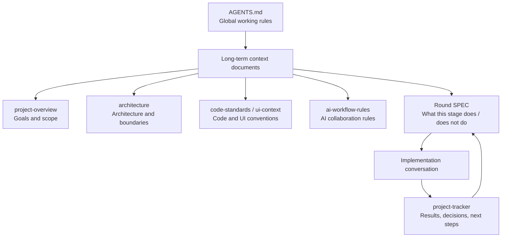
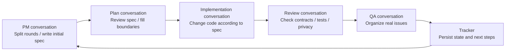

## Introduction: Written for Myself One Month Ago

After bringing Fast Sub to its current stage, I finally feel able to answer a question I kept asking myself a month ago: if you really want to use tools like Codex or Claude Code to build a complete project, how should you actually do it?

Back then, I wanted to find an article or video that showed a real project built from zero to something releasable with AI coding tools. Not a ten-minute demo, not a "type one sentence and generate an app" showcase, but a slightly complex real project: changing requirements, architecture tradeoffs, refactoring, testing, UI, packaging, QA, and cleanup before open sourcing. I looked around and found very little that I could actually reference.

To make the rest easier to understand, let me first describe the scale of Fast Sub. It ended up being much more than a simple script. It includes a Python CLI, Go product core, Go daemon/job API, Electron desktop UI, local worker, model download flow, providers, packaging, release checks, and open source documentation.

This is the complexity estimate I asked Codex to produce from the git history:

> Based on the git history, from the first commit to the current state, the time span is from 2026-04-24 to 2026-05-22, about 28 calendar days; counting both start and end dates, it is within 29 days. The number of active development days with commits is about 13. There are 71 commits in total, and the latest commit is `2026-05-22 Stabilize desktop readiness tests`. More precisely, this is an MVP demo built over roughly 4 calendar weeks, with about 2 weeks of active development days. In terms of human team effort, the current output feels like 2-3 people working intensely for 3-5 weeks, or a solo founder plus AI agents pushing it forward in about one month.

The project evolution can be compressed into this line:

After going through it myself, I now understand why this kind of experience is hard to compress into a short "tutorial." Many articles eventually turn into distilled methodology. They look correct, but when you actually start a project, you still do not know what to do first, when to stop, or where human judgment is required.

So this article is more like a note to myself from one month ago. It is not meant to prove how powerful Codex is, nor to claim that AI can replace all development work. On the contrary, my biggest takeaway is this: the stronger AI coding tools become, the more you need your own process. Otherwise, they can write very fast, but they can also pull the project off course very fast.

I am still figuring this out myself. What follows is definitely not a standard answer. More accurately, it is a set of temporary lessons I learned by building Fast Sub.

## 1. My Biggest Shift: I No Longer Treat AI Coding as Autopilot

When I first started using AI to write code, it was easy to fall into an illusion: as long as I described the requirement clearly, it could keep driving forward.

For temporary scripts, that feeling is often true. You say you want to process a file, call an API, or generate some test data. It writes the code, you run it, fix a few small issues, and the task is done.

But Fast Sub was not that kind of project. It started as a Python CLI, then added a Go product core, daemon/job API, Electron desktop app, packaging, model downloads, real providers, QA smoke tests, and open source documentation. Once the project reached that scale, it became increasingly obvious to me that AI coding is not autopilot.

It is more like a collaborator with strong execution ability and broad knowledge, but one that badly needs context and boundaries. If you tell it, "For now, only build the mock; do not connect to the real daemon," it can execute that well. If you tell it, "This JSON schema and these exit codes must not be broken," it will try to respect that. But if those constraints exist only in your head, or are scattered in chat history from several days ago, it will eventually forget.

I kept coming back to one sentence:

> Complexity does not disappear. It only moves somewhere else.

If you do not control scope during the MVP stage, complexity moves into rework later. If you do not freeze context in documentation, complexity moves into the cost of explaining things in every new conversation. If you do not expose problems during testing and QA, complexity moves to the moment when real users try the product.

That is how I now think about Codex: it is not a driver replacing you behind the wheel. It is more like a very capable teammate. You need to give it a map, boundaries, acceptance criteria, and you also need to know when to hit the brakes.

## 2. MVP: Close the Smallest Loop First, Do Not Build the Whole System Up Front

When I say MVP here, I do not mean a formal product concept. I simply mean the smallest version that can run through the core flow.

When starting from zero, I also had the impulse to think: since AI can write code so fast, maybe I can plan the whole system from the beginning. Features, architecture, documentation, tests, UI, all done at once.

Later I found this unrealistic for a personal project. Mature teams can invest heavily in upfront design because they have people, review processes, experience, and relatively stable requirement inputs. But for personal projects, many things only become clear while building. AI can help you discuss options, but it cannot make all product judgments for you.

Fast Sub's path basically emerged while building:

1. First, use a Python CLI to run the local subtitle generation and translation flow.
2. Then gradually move more stable orchestration, providers, models, and daemon boundaries into Go.
3. Then build the Electron UI, using a mock-first approach instead of rushing into the real backend.
4. Finally, enter packaging, real smoke tests, QA, and open source cleanup.

Looking back, this path was not elegant, but it fit a personal project well. Each stage answered one question: can the core capability run? Should the engineering boundary change? What is still missing for real user usage?

But MVP does not mean letting AI start coding immediately. This is a trap I think beginners are especially likely to fall into. Claude Code and Codex are both very eager to start writing code after you describe a requirement. They are almost too proactive. If you are writing a temporary script, that is fine. But for a somewhat serious project, this is exactly where things can start going out of control.

I later started by asking AI to do research first: search similar projects, analyze existing approaches, compare technology stacks, list risks, and generate an initial MVP document. During this process, I would paste in materials I found, and I would also ask another model to review it from a different angle. For example, I might ask it to act like a senior architect and check whether the MVP is overdesigned; or the opposite, ask it to identify places where the plan is too optimistic.

There is nothing magical about the prompt here. At least as of 2026-05-22, my feeling is that instead of worshiping a particular incantation, it is better to clearly explain the requirement, constraints, reference projects, and your own questions. When necessary, you should definitely ask AI to look things up online. Codex can sometimes produce outdated Next.js, GitHub Actions, or Node version configurations. If you do not check these, they may become strange warnings or build failures later.

After the MVP document is ready, I ask AI to act as a project manager and split the project into several rounds. Each round must clearly state its goal, scope, and acceptance criteria. Execution then becomes much simpler: refine the round document, create a branch, implement, and finally validate according to the document.

This step looks slow, but it saves time later.

## 3. SPEC and Documentation: Do Not Let AI Improvise in Ambiguous Requirements

When coding with AI, it is easy to treat the prompt as the requirement document. But in complex projects, prompts are too lightweight.

A prompt is more like a verbal handoff. It can start a task, but it cannot carry long-term constraints. A feature may span multiple files, multiple modules, multiple conversations, or even multiple days. If all decisions live only in chat history, they will almost certainly be lost later.

In the later Electron development of Fast Sub, I basically switched to specs-driven work. Round 11 was the Electron mock-first shell. Round 12 connected the Go daemon. Round 13 focused on productization and release readiness. Each round had a corresponding document that stated what this round would do, what it would not do, which contracts it would affect, and how it would be accepted.

This matters a lot for AI, because AI is very good at "while I am here." You ask it to fix a UI issue, and it may also adjust state management. You ask it to add a daemon API, and it may also adjust the renderer contract. Often it is not trying to misbehave. It is simply judging from local context that "this is more reasonable." But in a project, not everything that is locally reasonable can be changed: CLI arguments, JSON schemas, exit codes, provider contracts, and remote upload confirmation flows are examples.

To AI, code is just code. To the project, some code is actually a contract. Once it changes, users, tests, UI, and documentation may all break. This is especially true when working on boundaries like a CLI, daemon API, or provider. You cannot let AI treat "this looks more reasonable" as "it is okay to change public behavior."

So in a SPEC, what I care about most is not only "what to do," but "what not to do."

For example, Round 11 explicitly did not connect to the real daemon and did not call real ffmpeg, the Python worker, or provider runtimes. Round 12 was when the real daemon was connected. Round 13 focused on packaging, diagnostics, tests, and release quality, without introducing new core business architecture.

With these boundaries, AI's freedom actually becomes more stable. It knows this round should only solve this round's problems. When it finds something out of scope, it records a follow-up instead of immediately changing it.

My current habit is: before a large implementation, write a SPEC, review it myself, then ask another conversation or model to review it. The goal is not to make the document beautiful. The goal is to expose ambiguity before touching code.

## 4. Context Management: Move Project Memory Out of the Chat Window

The first few rounds of Fast Sub were mostly driven by conversations. At the beginning, this was fine. The project was still small, and AI could keep up. But as development continued, the problems became obvious.

The most typical case was that the project manager conversation forgot its own role and started editing code. Some conversations forgot what had already been completed, or did not know which contracts were untouchable. If you reminded it once, it would return to normal; after a while, it might drift again.

This is not because one specific model is especially bad. LLM conversations are simply not stable memory. Tools like Claude Code and Codex help maintain context, but context is still limited. Long conversations get compressed, details are lost, and lots of no-longer-important information gets mixed in.

Later I referred to JS Mastery's [The Six-File Context System](https://www.youtube.com/watch?v=14RP8liACqo), as well as the corresponding [Six-File Context System Guide download page](https://jsmastery.com/waitlist/six-file-context). I did not copy it exactly. Instead, I adapted it into a set of documents that fit Fast Sub at the time. For the UI stage, the most important ones were:

- `project-overview.md`: project goals, scope, and stage.
- `architecture.md`: architecture boundaries, module responsibilities, and data flow.
- `code-standards.md`: code style and implementation conventions.
- `ui-context.md`: UI tokens, visual rules, and component conventions.
- `ai-workflow-rules.md`: AI workflow rules.
- `project-tracker.md`: current progress, decisions, and next steps.

These files were not there to make the repository look more "professional." They were there so a new conversation could pick up the project. Before an implementation conversation starts, it reads these context files. After code changes are done, the tracker is updated. Project memory no longer depends entirely on a single chat window.

The context structure I ended up with looks roughly like this:

This change helped a lot later. With these files in place, Codex's plans became noticeably closer to the actual project state, and it forgot constraints less often. The cost was that it spent a bit longer thinking each time, and the answers felt less lightweight. For a complex project, I am willing to pay that cost.

I also realized that context management does not mean stuffing everything into AI. Too little context causes misunderstanding. Too much context slows it down and may make it miss the point. A better approach is to put long-term stable information in project documents, and current-stage information in SPECs and the tracker.

## 5. Multi-Conversation Collaboration: Separate PM, Implementation, Review, and QA

I now rarely put a complex project into a single chat window.

The longer a single conversation gets, the more it turns into a stew. Planning, implementation, review, QA, and release documentation all mixed together make it difficult for AI to maintain a stable role. You just asked it to finish an implementation round, then asked it to review its own code, then asked it to plan the next round. The contexts easily get tangled.

Later, I kept several standing conversations:

1. Project manager: does not write code; only handles planning, documentation, round breakdown, and prompts for implementation branches.
2. Plan: reviews and refines documents, for example by referencing strong projects and filling gaps in round docs.
3. Review: performs code review before an implementation branch is merged, identifies issues, and pushes for fixes.

Actual implementation happens in a new conversation. The implementation conversation receives only the SPEC and context needed for the current round, without carrying too much historical baggage.

At first this felt slightly cumbersome, but later it became much more comfortable. The PM conversation acts more like a project state machine, responsible for clarifying work. The implementation conversation is more like a temporary worker that takes a clear task and executes. The review conversation focuses on finding problems. Handoffs between conversations do not rely on "do you remember?" but on documents and the tracker.

For example: the PM conversation first generates the Round 12 daemon integration spec; the Plan conversation reviews it, focusing on daemon API, secrets, SSE, and configuration write boundaries; the implementation conversation connects the real daemon client according to the spec; the Review conversation checks contracts, privacy, and test gaps; finally, the QA conversation organizes issues found during real desktop testing and writes results back to the tracker. Each conversation carries one type of cognitive load.

Drawn as a loop, it looks roughly like this:

Some rounds can be split further into multiple worktrees and developed in parallel. I once tried up to 4 worktrees at the same time, and the efficiency was genuinely high. But there is one precondition: the tasks must be cut cleanly enough. If several branches all modify the same state management or the same contract, merging becomes painful.

My workflow is basically to keep the main branch clean, rebase feature branches onto the primary branch (`main` / `master`), then merge with fast-forward. This makes review and rollback clearer. This may not fit everyone, but for a personal project, it was easier to control than having many branches merge into each other.

If each conversation is also given some dedicated skills, it starts to feel a bit like agents. But I do not want to make it sound mystical. For code development, simply making different conversations responsible for different roles already solves many problems.

## 6. Code Quality and Refactoring: Tests Are Guardrails, Not Decorations

After using Codex, it became hard for me to review every generated line one by one. Not because I did not want to, but because it was not realistic. AI generates code too fast. Once the project becomes complex, human line-by-line review quickly falls behind.

So what should we do? My feeling is that tests must become guardrails, not decorations.

In Fast Sub, many things must not be changed casually: CLI command names, arguments, JSON schemas, exit codes, provider contracts, daemon APIs, secret redaction, and remote upload confirmation. Verbal reminders are not enough. These must be written into documentation and covered by tests as much as possible.

The validation I ran differed by stage. On the Python side, there were ruff, mypy, and pytest. On the Go side, there was go test. On the Electron side, there were typecheck, unit tests, build, and smoke tests. By Round 13, I also needed packaged smoke, installer smoke, real local provider/file smoke, long-task cancellation smoke, screenshot baselines, and license inventory.

But automated tests are not everything. You still need to manually run the core flow. This is especially true for desktop apps. Many problems only appear when you actually click through the app: whether a button is clickable, whether a long filename breaks a dialog, whether error messages are understandable, whether task state jumps after switching away and back, whether GPU processes remain after canceling a job.

I also hit issues with refactoring.

After the Python part was done, the project already had more than ten Python files, and some files were thousands of lines long. That was when I realized I was paying debt for not defining the project architecture and code style earlier. If there had been clearer context files and code boundaries from the beginning, the later pain might have been smaller.

At first I wanted Codex to refactor everything in one shot based on a reasonable architecture diagram. The result was not ideal. It could produce a directory structure that looked good, but at the concrete file level it often used shims to route around the problem, and the code was not really moved much.

In the end, I had to point out issues one directory at a time and let Codex make smaller changes. Fortunately, the test coverage was good enough that after each change I could quickly verify whether behavior had been broken.

My view on AI refactoring has become more conservative since then: it is very good at splitting files, extracting types, and organizing modules, but only if you first define what "not broken" means. Without tests, boundaries, and a small-step rhythm, refactoring can easily become another disaster.

## 7. UI Prototyping: Mock-First Was the Most Valuable Lesson

After the Python and Go parts were completed, UI was what worried me most, because I had almost no experience building a complete desktop UI.

The first time I used Claude Design to generate prototypes, I was honestly stunned. I only gave it a rough page description and the `daemon-api.md` iterated earlier, and it produced several visual styles plus prototypes for more than a dozen major pages. It felt like I was still describing requirements with stone-age tools, while it had already placed an entire interface world in front of me.

But the shock soon turned into another practical problem: this kind of visual iteration consumes a lot of quota and context. After changing only a few pages, the account quota would already start to feel tight.

Later I downloaded the prototype files and let Codex continue modifying them. One lesson here is important: prototype code alone is not enough. If Codex only sees the code, it is hard for it to reliably reproduce the visual effect. It is much better to also provide screenshots of each prototype page, so it can reference both structure and final appearance.

Looking back, there should already be easier ways to do this now. For example, [Open Design](https://opendesigner.io/) can basically be understood as an open source alternative to Claude Design. It connects the design-generation workflow to coding-agent CLIs you already use, including Codex, Claude Code, Cursor, Gemini, OpenCode, and others. That would avoid the back-and-forth I had at the time between Claude Design and Codex, moving prototype files, screenshots, and revision notes around.

Once the prototype was roughly ready, I did not connect the real backend immediately. I went mock-first.

Fast Sub's Round 11 was the Electron mock-first shell: establish the `FastSubClient` contract, Mock client, first launch flow, main screen, job queue, and settings page. This stage did not connect to the real daemon, and did not call real ffmpeg, Python workers, or model downloads.

This later proved very worthwhile. The UI could validate information architecture and state flow first, without being blocked by backend readiness. When Round 12 connected the real daemon, the client contract already existed, and the pages did not need to be rebuilt.

If the UI had connected to the real daemon from the beginning, problems would have been mixed together: if a button did not respond, was it a UI state bug, a daemon API bug, or a job event mapping bug? Mock-first removed at least half of that uncertainty.

So if I build a similar project again, I will still mock first. Even if part of the backend is already available, I would rather smooth out the user flow with mocks first, then gradually replace them with real implementation.

## 8. QA and Open Source Cleanup: The Last Mile Takes the Most Time

After connecting the real daemon worker, the project entered the stage where I spent the most time.

When building command-line tools, I had always wondered: why does wrapping a CLI in a UI shell noticeably lower the barrier to use? AI is so convenient now, so why are many tools still stuck at the command line?

After actually building a desktop version myself, I understood. The last mile of UI is extremely fragmented, and many problems are hard to catch ahead of time with automated tests.

For example: is the button where users expect it to be? Will very long batch filenames break the confirmation dialog? Is the error message understandable after a task fails? Does the state jump when a generating task goes to the background and comes back? Are GPU processes left behind after canceling a long task? These are not problems you can confidently solve with one unit test.

I spent more than a week on this part. Honestly, it was quite draining.

The thing that improved efficiency a bit was building a QA test table. Do not open a new conversation and fix one issue immediately every time you find a problem. Instead, record issues in batches, classify them in batches, and then let Codex handle them by category. This is much more efficient, and it also makes it easier to confirm which issues have been fixed and which still need retesting.

Late-stage Fast Sub QA covered many scenarios that only fail in real usage:

- Installer and portable zip.
- First launch and default model download.
- Chinese, Japanese, Korean, and paths with spaces.
- Local Faster Whisper, whisper.cpp, and NLLB.
- Long-task cancellation and process cleanup.
- API key save, replace, and delete.
- Privacy redaction.
- Diagnostics page and screenshot baselines.

There is another point I only truly understood later: the packaged app is the real product. Dev mode running successfully only proves that it runs in the development environment. In a packaged app, many previously invisible issues appear: app-private Python runtime, daemon cwd, resource paths, Windows installer, portable zip, child processes left after exit, macOS signing and permissions. Fast Sub Round 13 spent a lot of time on these things, and looking back, it was worth it, because they determine whether a user can actually use the app after downloading it.

Before open sourcing, there was another category of cleanup that did not look like coding, but was not small at all: README, CHANGELOG, CONTRIBUTING, SECURITY, LICENSE, third-party dependency license inventory, privacy notes, installation instructions, and troubleshooting documentation.

You also need to clean up things that cannot be public, such as API keys, local machine paths, large model files, large media files, real benchmark output, and temporary build artifacts.

This step is easy to underestimate. For developers, working code can feel like the end. But for external users, documentation, privacy notes, installation instructions, and known limitations are all part of the project's credibility. AI is good at generating a first draft of documentation, but you must review the promises in those docs yourself. Installation instructions, privacy notes, and known limitations in particular cannot be allowed to sound too optimistic.

Fast Sub is also local-first, so the privacy boundary must be explicit. Remote providers must not become implicit behavior. Any path that uploads audio or subtitle text must be explicitly selected and confirmed by the user.

## 9. Pitfalls I Hit: Complexity Does Not Disappear, It Only Moves

If I compress this experience into a few pitfalls, they would be these.

At first, I trusted AI too much to "write and organize as it goes." The result was that the Python code later had large files and mixed responsibilities, and I had to spend dedicated time refactoring.

Early context depended too much on chat windows. Once a conversation became long, AI easily forgot constraints and sometimes even started doing things it should not do.

At some stages I asked AI to do too much at once. When the scope became large, bugs and drift stacked together, making later debugging exhausting.

The early UI prototypes were not detailed enough. Many interaction issues only appeared during real QA.

I also underestimated the difference between packaged apps and real environments. Running in dev mode does not mean running after packaging. System Python, app-private Python, daemon cwd, process cleanup, and path permissions are only truly exposed after packaging.

Behind all these pitfalls is the same issue: complexity does not disappear, it only moves.

AI can help you write code faster, but it cannot make complexity vanish. If you do not handle it during requirements, it appears during implementation. If you do not handle it during implementation, it appears during QA. If you do not handle it during QA, it appears in front of users.

## 10. If I Did It Again, What I Would Do Earlier

If I were to build Fast Sub again from scratch now, I would not overturn the overall path, but there are several things I would definitely do earlier.

First, create context files from the beginning. Do not wait until conversations start forgetting things and code starts swelling. Even rough `project-overview`, `architecture`, `code-standards`, and `project-tracker` files are better than relying entirely on chat history.

Second, define directory structure and code style earlier. Refactoring after early Python files grew large cost more than I expected. AI can help you refactor, but it is not good at absorbing the consequences of "we did not define boundaries earlier" on your behalf.

Third, during the UI prototype stage, organize screenshots, states, and copy more carefully. The rougher the prototype, the more interaction detail you need to patch during QA. Especially for desktop tools, empty states, error states, batch jobs, cancellation, and failed retry flows are best thought through during the mock stage.

Fourth, establish a QA table earlier. Do not wait until last-mile issues explode before systematically recording them. A QA table is not only a test checklist; it is also an input format for collaborating with AI on bug fixes.

Fifth, separate feature work, refactoring, and release work more strictly in every round. AI easily mixes them together, but their acceptance criteria are completely different. For features, you check whether user capability increased. For refactoring, you check whether behavior stayed the same. For release work, you check whether the real environment runs successfully.

None of these are flashy tricks, but they would have saved me a lot of debt.

## 11. Conclusion: Look Less for Magic Prompts, Build Your Own Process More

After building this project with Codex, my view of AI coding changed quite a bit.

I no longer think the key is finding a universal prompt. Prompts are useful, skills are useful, and tools will keep getting stronger. But what complex projects really test is whether you have your own process.

If you are just starting to use Codex or similar tools for projects, I would suggest beginning with these:

1. Build an MVP first; do not build the whole system up front.
2. Write a SPEC before large tasks, especially making clear what not to do.
3. Put long-term context in project documents, not only in chat history.
4. Use multiple conversations to separate PM, implementation, review, and QA.
5. Give every round of changes tests and validation; do not only trust AI saying "done."
6. Use mock-first for UI, then connect the real backend after the flow is stable.
7. Record QA issues in batches, fix them in batches, and retest them in batches.
8. Before open sourcing, do a separate pass for documentation, privacy, licenses, and release notes.

None of this sounds cool, and it is less attractive than a single magical prompt. But these are the things I found genuinely useful this time.

AI coding is not autopilot. It is more like bringing a very capable collaborator into your development process. The clearer your process is, the more it amplifies your ability. The messier your process is, the faster it amplifies the mess.

That is probably the most honest conclusion I have after hitting these pitfalls.
