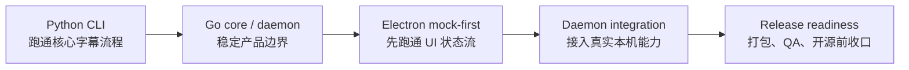
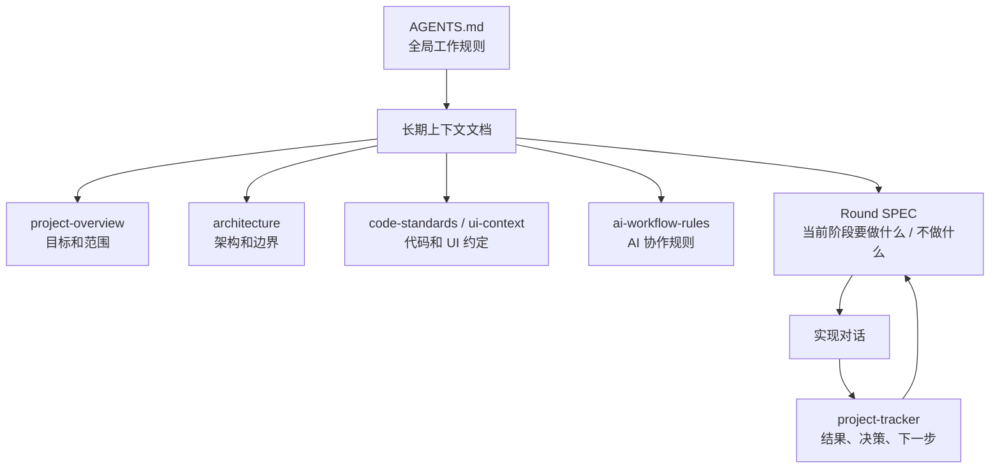
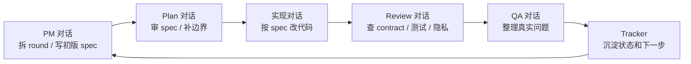

## 开头：写给一个月前的自己

Fast Sub 做到现在这个阶段后，我发现自己终于能回答一个月前一直想问的问题了：如果真的想用 Codex、Claude Code 这类工具做一个完整项目，到底应该怎么做？

我当时很想找一篇真正从 0 开始，用 AI 编程工具把项目做到能发布的文章或者视频。不是那种十分钟 demo，也不是“输入一句话生成一个 App”的展示，而是一个稍微复杂一点的真实项目：会有需求变化、架构取舍、重构、测试、UI、打包、QA、开源前整理。找了一圈之后，能参考的东西不多。

先交代一下 Fast Sub 的体量，方便理解后面为什么我一直在讲上下文、测试和 QA。它最后不是一个单纯脚本，而是包含 Python CLI、Go product core、Go daemon/job API、Electron 桌面 UI、本地 worker、模型下载、provider、打包、发布检查和开源文档的一整套项目。

下面这段是我让 Codex 根据 git 历史给出的复杂度估算：

> 按 git 历史看，从 first commit 到当前状态，时间跨度是 2026-04-24 到 2026-05-22，约 28 天自然日；如果按包含首尾日期说，就是 29 天内。真正有提交的活跃开发日大概是 13 天，总提交数 71 个，最新提交是 `2026-05-22 Stabilize desktop readiness tests`。更准确地说，它是一个约 4 周自然时间、集中开发大概 2 周左右活跃工作日推进出来的 MVP Demo。按人类小队估算，当前产出更像是 2-3 人高强度干 3-5 周，或者一个 solo founder 加 AI agent 在约 1 个月里推出来的结果。

项目演进大概可以压成这条线：

现在自己做完一遍，大概也知道为什么了。因为这种体量的经验，很难被压缩成一个几千字的“教程”。很多文章最后都会变成提纯过的方法论，看起来很正确，但我真正开项目时，还是会卡在第一步该怎么做、什么时候该停下来、哪些地方要自己判断这些问题上。

所以这篇文章更像是给一个月前的我写的备忘录。它不是要证明 Codex 多强，也不是要说 AI 可以替我完成所有开发。只是做完这一轮后，我对“怎么和 AI 一起推进一个项目”有了一些更具体的感受。

我自己也还在摸索，下面的内容肯定不是标准答案。更准确地说，它只是我用 Fast Sub 这个项目踩出来的一套阶段性经验。

## 1. 做完这个项目后，我对 AI 编程的看法变了

刚开始用 AI 写代码的时候，很容易有一种错觉：只要把需求说清楚，后面就可以交给它自己推进。

写临时脚本时，这个感觉确实成立。我说要处理一个文件、调一个 API、生成一段测试数据，它写出来，我跑一下，修几个小问题，事情就结束了。

但 Fast Sub 不是这种项目。它从 Python CLI 开始，后来加了 Go product core、daemon/job API，再到 Electron 桌面端、打包、模型下载、真实 provider、QA smoke 和开源文档。项目一旦到这个规模，我越来越明显地感觉到，不能把 AI 编程当成放手托管。

它更像一个执行力很强、知识面很广、但非常需要上下文和边界的协作者。我告诉它“现在只做 mock，不要接真实 daemon”，它可以很好地执行。我告诉它“这个 JSON schema 和退出码不能破坏”，它也能尽量遵守。但如果这些约束只存在我脑子里，或者散落在前几天的聊天记录里，那它迟早会忘。

我后来反复想到一句话：

> 复杂度不会消失，只会转移。

我不在 MVP 阶段控制范围，复杂度就会转移到后面的返工里。我不在文档里固定上下文，复杂度就会转移到每个新对话的解释成本里。我不在测试和 QA 阶段暴露问题，复杂度就会转移到用户真正使用的时候。

这也是我现在看 Codex 的方式：它不是一个可以替我兜底的全自动系统，更像是一个很强的队友。我得给它上下文、边界、验收标准，也得知道什么时候该暂停下来重新判断。

## 2. MVP：我后来还是先回到了最小闭环

我这里说的 MVP，不是一个很正式的产品概念，只是第一个能跑通核心流程的最小版本。

从零做项目时，我一开始也会有冲动：既然 AI 写代码这么快，那是不是可以一上来就把完整系统规划好？功能、架构、文档、测试、UI，全都一次性做出来。

后来发现，这个想法对个人项目不太现实。成熟团队可以在前期做大量设计，因为他们有人力、有评审、有经验，也有比较稳定的需求输入。但个人项目很多时候是在做的过程中才逐渐想清楚。AI 可以帮我讨论方案，但不能替我做所有产品判断。

Fast Sub 的路线基本是边做边收敛出来的：

1. 先用 Python CLI 把本地字幕生成和翻译主流程跑通。
2. 再把更稳定的业务编排、provider、模型和 daemon 边界逐步迁到 Go。
3. 然后做 Electron UI，而且先走 mock-first，不急着接真实后端。
4. 最后才进入打包、真实 smoke、QA、开源前整理。

现在回头看，这条路线不算优雅，但它很适合个人项目。每一阶段都能回答一个问题：核心能力能不能跑？工程边界要不要调整？真实用户使用时还缺什么？

不过 MVP 不等于让 AI 直接开写。这个坑我自己也差点踩进去。Claude Code、Codex 都很容易在我提完需求后立刻开始写代码，它们太积极了。如果只是写一个临时脚本，这没问题。但如果是一个稍微严肃一点的项目，从这里开始就可能失控。

我后来会先让 AI 做调研：搜索类似项目，分析现有方案，比较技术栈，列风险，再生成一份初版 MVP 文档。这个过程里，我会把自己看到的资料贴进去，也会让另一个模型从不同角度审一遍。比如让它假设自己是资深架构师，看看这个 MVP 有没有过度设计；或者反过来，让它挑一下哪些地方太乐观。

这里 prompt 没有多神秘。至少到 2026-05-22 这个阶段，我的感受是，与其迷信某句咒语，不如把需求、约束、参考项目和自己的疑问讲清楚。有些依赖版本、GitHub Actions、Node 配置之类的信息，我后来也会让 AI 联网确认一下。不然它偶尔会给出过时答案，后面就会变成莫名其妙的 warning 或构建失败。

MVP 文档出来后，我会继续让 AI 扮演 project manager，把项目拆成几轮 round。每轮写清楚目标、范围和验收方式。后面执行时就简单很多：先完善 round 文档，再切分支实现，最后按文档验收。

这一步看起来慢，但它是在帮后面省时间。

## 3. SPEC 和文档：我开始把模糊的地方先写下来

用 AI 编程时，很容易把 prompt 当成需求文档。但复杂项目里，prompt 太轻了。

prompt 更像一次口头交代，可以启动任务，但承载不了长期约束。一个功能可能会跨多个文件、多个模块、多个对话，甚至跨几天时间。如果所有决策都只在聊天记录里，后面基本一定会丢。

Fast Sub 后期的 Electron 开发，我基本改成 specs-driven。Round 11 做 Electron mock-first shell，Round 12 接 Go daemon，Round 13 做产品化和发布准备。每一轮都有对应文档，里面写清楚这一轮做什么、不做什么、会影响哪些 contract、完成后怎么验收。

这对 AI 特别重要。因为 AI 很擅长“顺便”。我让它修一个 UI 问题，它可能顺便改了状态管理。我让它补一个 daemon API，它可能顺便调整了 renderer contract。很多时候它不是故意乱来，只是它会根据局部上下文判断“这样更合理”。但项目里有些东西不是局部合理就能改的，比如 CLI 参数、JSON schema、退出码、provider contract、远程上传确认逻辑。

对 AI 来说，代码只是代码；但对项目来说，有些代码其实是 contract。它们一旦变了，用户、测试、UI、文档都会跟着坏。尤其是做 CLI、daemon API、provider 这类边界时，不能让 AI 把“看起来更合理”当成“可以改公开行为”。

所以 SPEC 里我后来最看重的，其实不是“要做什么”，而是“不能做什么”。

比如 Round 11 明确不接真实 daemon，不调用真实 ffmpeg、Python worker 或 provider runtime。Round 12 才接真实 daemon。Round 13 聚焦打包、诊断、测试和发布质量，不再引入新的核心业务架构。

有了这些边界，AI 的发挥空间反而更稳定。它更容易知道这一轮只该解决这一轮的问题，遇到超出范围的东西就记录 follow-up，而不是直接动手。

我现在的习惯是：大的实现前先写 SPEC，自己审一遍，再让另一个对话或模型审一遍。不是为了写得多漂亮，而是为了在动代码前先把模糊的地方暴露出来。

## 4. 上下文管理：后来我不再只依赖聊天记录

Fast Sub 前几轮基本是靠对话推进的。一开始没什么问题，项目还小，AI 也能跟得上。但后面继续做时，问题开始变明显。

最典型的情况是 project manager 对话忘记了自己的角色，开始改代码。还有些对话会忘记之前完成了什么，或者不知道哪些 contract 是不能动的。我提醒它一次，它会恢复正常；过一段时间，又可能偏掉。

这不是某个模型特别差，而是 LLM 对话本来就不是稳定记忆。Claude Code、Codex 这些工具会帮我维护上下文，但上下文终究有限。对话长了会压缩，会丢细节，也会混入很多已经不重要的信息。

后来我参考了 JS Mastery 的 [The Six-File Context System](https://www.youtube.com/watch?v=14RP8liACqo) 这套做法，也看了它对应的 [Six-File Context System Guide 下载页](https://jsmastery.com/waitlist/six-file-context)。我没有完全照搬，而是按 Fast Sub 当时的状态改成了一组更适合自己项目的文档。以 UI 阶段为例，比较核心的是这几个：

- `project-overview.md`：项目目标、范围和阶段。
- `architecture.md`：架构边界、模块职责和数据流。
- `code-standards.md`：代码风格和实现约定。
- `ui-context.md`：UI token、视觉规则和组件约定。
- `ai-workflow-rules.md`：AI 工作流规则。
- `project-tracker.md`：当前进度、决策和下一步。

这些文件不是为了让仓库看起来更“工程化”，而是为了让新对话能接得上。实现对话开始前，我会让它先读这些上下文。改完代码后，再更新 tracker。这样项目记忆就不再完全依赖某一个聊天窗口。

我后来理解的上下文结构，大概是这样：

这个改变对后续帮助很大。有了这些文件后，Codex 给出的方案明显更贴近项目现状，也更少出现忘记约束的情况。代价是它每次思考会更久一点，回答也没那么轻快。但对复杂项目来说，我愿意付这个成本。

我后来也意识到，上下文管理不是把所有东西都塞给 AI。上下文太少，它会误解；上下文太多，它会变慢，也可能抓不住重点。所以对我来说更顺的方式，是把长期稳定的信息写进项目文档，把当前阶段的信息写进 SPEC 和 tracker。

## 5. 多对话协作：我把不同角色拆开了

我现在不太会把一个复杂项目塞进一个聊天窗口里。

单个对话越长，越容易变成一锅粥。规划、实现、review、QA、发布文档全混在一起后，AI 很难稳定保持同一个角色。我刚让它做完一轮实现，又让它审自己的代码，再让它规划下一轮，它很容易把上下文搅在一起。

我后面比较固定地保留了几个常驻对话：

1. Project manager：不写代码，只负责规划、文档、round 拆分，以及生成实现分支需要的 prompt。
2. Plan：审阅和细化文档，比如让它参考优秀项目，补充 round 文档里的缺口。
3. Review：在实现分支合并前做审查，发现问题后推动修复。

具体实现则重新开对话。实现对话只拿本轮需要的 SPEC 和上下文，不背太多历史包袱。

这个做法一开始看起来有点麻烦，但后面确实舒服很多。PM 对话更像项目状态机，负责把事情拆清楚；实现对话更像临时工，拿到明确任务就做；review 对话则专门挑问题。不同对话之间不靠“还记得吗”，而靠文档和 tracker 交接。

举个具体一点的流程：PM 对话先生成 Round 12 的 daemon integration spec；Plan 对话审一遍，重点看 daemon API、secret、SSE、配置写入这些边界有没有缺口；实现对话按 spec 接入真实 daemon client；Review 对话再检查 contract、隐私、测试遗漏；最后 QA 对话整理真实桌面测试里发现的问题，再把结果回写到 tracker。这样每个对话都只承担一类认知负担。

如果画成图，大概是这个循环：

有些 round 还能进一步拆成多个 worktree 并行做。我最多试过 4 个 worktree 同时开发，效率确实很高。但这里有一个前提：任务要切得足够干净。最后如果几个分支都改同一块状态管理、同一个 contract，合并时就会很痛苦。

我的工作流基本是主分支保持干净，功能分支 rebase 到主分支（`main` / `master`）后 fast-forward 合并。这样 review 和回滚都比较清楚。这个做法不一定适合所有人，但至少对我这种个人项目来说，比一堆分支互相 merge 要更容易控制。

每个对话再加上一些专属 skills，其实就有点像 agents 了。不过我现在还不想把它说得太玄。对代码开发来说，先做到“不同对话承担不同职责”，已经能解决很多问题。

## 6. 代码质量和重构：测试成了我判断能不能继续改的依据

用 Codex 之后，我很难再逐行 review 每一行代码。不是不想，而是不现实。AI 生成代码的速度太快，项目一复杂，靠人工一行行看，很快就会跟不上。

后来我的感受是，测试不能只是“有就行”的装饰，它得真的参与判断这次修改有没有把东西弄坏。

Fast Sub 里有很多东西不能被随便改：CLI 命令名、参数、JSON schema、退出码、provider contract、daemon API、secret redaction、远程上传确认。这些东西只靠口头提醒不够，要写进文档，也要尽量有测试覆盖。

不同阶段我跑的验证不一样。Python 侧有 ruff、mypy、pytest。Go 侧有 go test。Electron 侧有 typecheck、unit test、build、smoke。到了 Round 13，还要做 packaged smoke、installer smoke、真实本地 provider/file smoke、长任务取消 smoke、截图 baseline、license inventory。

但自动测试也不是万能的。核心流程我还是会自己手动跑一遍。尤其是桌面应用，很多问题只有真实点一遍才知道：按钮是不是能点，弹窗会不会被长文件名撑爆，失败信息用户能不能看懂，任务取消后进程有没有残留。

重构这块我也踩过坑。

Python 部分做完后，项目里已经有十几个 Python 文件，有些文件甚至几千行。那一刻我才意识到，前期没有规定好项目架构和代码风格，是会还债的。如果一开始就有更明确的 context 文件和代码边界，后面可能不会这么痛。

我一开始想让 Codex 直接根据合理架构图一步到位重构。结果并不理想。它能给出看起来不错的目录结构，但到了具体文件级别，经常用 shim 的方式把问题绕过去，代码其实没怎么挪。

最后我只能一个目录一个目录地指出问题，让 Codex 小范围改。好在测试比较齐全，每次改完都能很快验证有没有破坏行为。

后来我对 AI 重构的判断变得保守了：它很适合拆文件、抽类型、整理模块，但前提是我先定义什么叫“没改坏”。如果没有测试，没有边界，没有“小步改”的节奏，重构很容易变成另一场灾难。

## 7. UI 原型：mock-first 是这次比较值的一步

Python 和 Go 这部分完成后，我最担心的是 UI。因为我几乎没有完整做过桌面 UI。

结果第一次用 Claude Design 生成原型时，我是真的被震住了。我只给了很粗糙的页面描述和前面迭代出来的 `daemon-api.md`，它就给出了几种风格，以及十几个主要页面的原型图。那种感觉有点像：我还在用石器时代的方式描述需求，它已经把一整个界面世界摆在我面前了。

不过震惊很快变成了另一个现实问题：这种视觉迭代非常吃额度，也非常吃上下文。基本每改几个页面，账号额度就开始紧张。

后来我把原型文件下载下来，让 Codex 继续接手修改。这里有一个细节我后来才意识到：只给原型代码不够。Codex 只看代码，很难稳定还原视觉效果。我后来会同时给每个原型页面的截图，让它同时参考结构和最终视觉。

现在回头看，这一步现在可能已经有更省事的做法了。比如 [Open Design](https://opendesigner.io/)，基本可以理解成 Claude Design 的开源替代方案。它把设计生成流程接到现有的 coding-agent CLI 上，包括 Codex、Claude Code、Cursor、Gemini、OpenCode 等。如果当时已经用上这类工具，我可能就不用在 Claude Design 和 Codex 之间来回搬原型文件、截图和修改说明。

原型差不多后，我没有直接接真实后端，而是先做 mock-first。

Fast Sub 的 Round 11 就是 Electron mock-first shell：先建立 `FastSubClient` contract、Mock client、首次启动、主界面、任务队列、设置页。这个阶段不接真实 daemon，不调用真实 ffmpeg、Python worker 或模型下载。

这一步后来证明很值。UI 可以先把信息架构和状态流跑通，后端没完成时也不会阻塞。等到 Round 12 接真实 daemon 时，前面已经有了 client contract，页面也不需要推倒重来。

如果一开始 UI 就接真实 daemon，问题会混在一起：这个按钮没反应，到底是 UI 状态错了，还是 daemon API 错了，还是 job event 映射错了？mock-first 至少能先把一半不确定性拿掉。

所以现在让我再做类似项目，我大概率还是会先 mock。哪怕后端已经有一部分可用，我也更愿意先用 mock 把用户流程走顺，再逐步替换成真实实现。

## 8. QA 和开源前收口：最后一公里最花时间

接入真实 daemon worker 后，项目进入了我花时间最多的阶段。

做命令行工具时，我一直有点好奇：为什么只是给 CLI 套一个 UI 壳，就会明显降低使用门槛？现在 AI 这么方便，为什么很多工具还是停在命令行？

等自己真的做 desktop 版本后，我大概明白了。UI 的最后一公里非常碎，而且很多问题很难靠自动化测试提前发现。

比如按钮是不是在用户预期的位置，批量文件名太长会不会把确认弹窗撑爆，任务失败后错误信息是不是能看懂，生成中的任务切到后台再回来状态会不会跳，取消长任务后 GPU 进程有没有残留。这些问题不是写一个单元测试就能放心的。

这部分我做了一周多，说实话挺消耗耐心。

后来稍微提高效率的办法，是建立 QA 测试表。我不再发现一个问题就立刻开一个新对话修一个问题，而是批量记录、批量分类，再让 Codex 按类别处理。这样效率会高很多，也方便回头确认哪些问题已经修、哪些还要复测。

Fast Sub 后期 QA 覆盖了不少“真实使用才会出问题”的场景：

- installer 和 portable zip。
- 首次启动和默认模型下载。
- 中文、日文、韩文、空格路径。
- 本地 Faster Whisper、whisper.cpp、NLLB。
- 长任务取消和进程清理。
- API key 保存、替换、删除。
- 隐私 redaction。
- 诊断页和截图 baseline。

这里还有一个我后面才真正体会到的点：打包后才是真实产品。dev 模式能跑，只能说明开发环境里能跑。到了 packaged app，很多之前看不到的问题才会冒出来，比如 app 私有 Python runtime、daemon 的 cwd、资源路径、Windows installer、portable zip、退出后子进程残留、macOS 签名和权限。Fast Sub Round 13 花了很多时间在这些事情上，回头看很值，因为它们才决定一个用户下载后能不能真的用。

开源前还有另一类收口工作，看起来不像写代码，但一点也不少：README、CHANGELOG、CONTRIBUTING、SECURITY、LICENSE、第三方依赖 license inventory、隐私说明、安装说明、排障文档。

还要清理不能公开的东西，比如 API key、本机路径、大模型文件、大型媒体文件、真实 benchmark 输出、临时构建产物。

这一步我一开始也低估了。对开发者来说，代码能跑好像就结束了。但对外部用户来说，文档、隐私说明、安装说明和已知限制，都是项目可信度的一部分。AI 很适合帮我生成第一版文档，但文档里的承诺还是要自己审。尤其是安装说明、隐私说明、已知限制，不能让 AI 写得太乐观。

Fast Sub 又是本地优先工具，所以隐私边界得写清楚。远程 provider 不能变成隐式行为，任何上传音频或字幕文本的路径，我都希望它是用户显式选择和确认的。

## 9. 我踩过的坑：复杂度不会消失，只会转移

如果把这次经历压缩成几个坑，大概是这些。

一开始太相信 AI 可以边写边整理。结果 Python 代码后面出现大文件和职责混杂，不得不专门花时间重构。

前期上下文太依赖聊天窗口。对话一长，AI 就容易忘记约束，甚至开始做自己不该做的事情。

有些阶段让 AI 一次做太多。scope 一大，bug 和偏差就会叠在一起，后面排查起来很累。

UI 原型早期不够细。后面真实 QA 时，很多交互问题才暴露出来。

还有就是低估了 packaged app 和真实环境的差异。dev 模式能跑，不代表打包后能跑。系统 Python、app 私有 Python、daemon cwd、进程清理、路径权限，这些问题只有打包后才真的暴露。

这些坑背后其实是同一个问题：复杂度不会消失，只会转移。

AI 可以帮我更快写代码，但不能让复杂度消失。有些问题早期不处理，后面还是会在实现、QA 或真实使用时冒出来。

## 10. 如果重来一次，我会提前做什么

如果现在让我从头再做一次 Fast Sub，我不会推翻现在的路线，但有几件事一定会提前做。

第一，项目一开始就建立 context 文件。不是等到对话开始忘事、代码开始膨胀后再补。哪怕一开始只是很粗的 `project-overview`、`architecture`、`code-standards` 和 `project-tracker`，也比全靠聊天记录强。

第二，更早规定目录结构和代码风格。Python 前期文件膨胀后再重构，成本比我预期高。AI 可以帮我重构，但它不擅长替我承担“前期没定边界”的后果。

第三，UI 原型阶段会把截图、状态和文案整理得更细。原型越粗，后面 QA 时补交互细节就越多。尤其是桌面工具，空状态、错误状态、批量任务、取消、失败重试这些页面，我会尽量在 mock 阶段就想清楚。

第四，更早建立 QA 表。我不想再等到最后一公里问题爆出来，才开始系统记录。QA 表不仅是测试清单，也是和 AI 协作修 bug 的输入格式。

第五，每个 round 更严格地区分 feature、refactor 和 release work。AI 很容易把它们混在一起，但这三类工作的验收标准完全不同。feature 看用户能力有没有增加，refactor 看行为有没有保持，release work 看真实环境有没有跑通。

这些都不是很炫的技巧，但如果一开始就做，我大概能少还不少债。

## 11. 总结：这次之后，我没那么迷信 prompt 了

用 Codex 做完这个项目后，我对 AI 编程的看法变了不少。

我不再觉得关键是找到某个万能 prompt。prompt 有用，skills 有用，工具也会越来越强。但这次做下来，我更明显地感觉到，复杂项目真正消耗人的地方，还是范围控制、上下文、验证和收尾。

如果只给这次经历做一个备忘录，我大概会记下这几件事：

1. 我会先做 MVP，不会一上来就规划完整系统。
2. 大任务前，我会先写 SPEC，尤其写清楚这轮不做什么。
3. 长期上下文会放进项目文档，不再只靠聊天记录。
4. PM、实现、review、QA 这几类对话，我会继续分开。
5. 每轮修改后，我会看测试和验证结果，不只看 AI 说“完成了”。
6. UI 还是会先 mock-first，等流程稳定再接真实后端。
7. QA 问题会批量记录、批量修复、批量复测。
8. 开源前会单独留时间做文档、隐私、许可证和发布说明收口。

这些听起来都不酷，也没有一句神奇 prompt 来得吸引人。但这是我这次真正留下来的东西。

AI 编程不是把项目交出去就结束了。它更像是把一个很强的协作者接进开发流程。流程越清楚，它越能放大人的能力。流程越混乱，它也会更快地放大混乱。

这大概就是我目前做完这个项目后，最想写给一个月前自己的结论。
